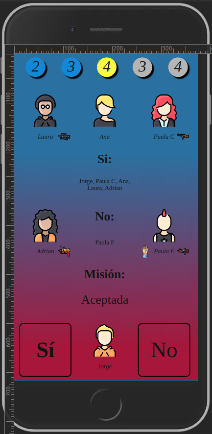
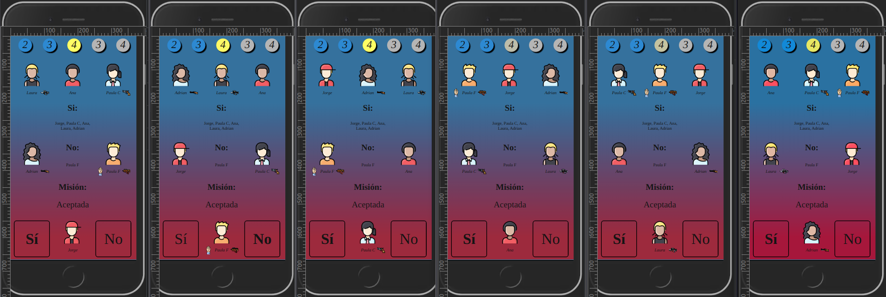

# Resistencia:

My own version of the board game "[The Resistance](http://devir.es/producto/la-resistencia/)".

## Version history:
### v0.5:
- v0.5.1:
    - Testing full game.
    - Logo added.
- v0.5.0:
    - RootMenu:
        - Bug where the result of a successful mission was inverted fixed.
        - Logic updated at updateMissions to get the Success-Failure using less code.
        - Now the resultPoll label stores the current votation to create a team. Therefore, it only apears on active missions.
    - String concatenation updated to new version: MainMenu, GameOver, RootMenu, Meetup and missionPoll.
    - Code not used anymore removed.
    - At common.js: code updated, minor changes and obsolete code removed.
    - Use of [Code style converter](https://github.com/Jkutkut/PY_Code-style-converter) to generate style.min.css & common.min.js.
    - getDB function works on user side and lastTime logic works on server. This change will reduce a lot the network consumtion.
    - New standar to get and store content from DB:
        - RootMenu.
        - MainMenu.
    - Now on MainMenu, the status of the first getDB is checked to see if the game has started.
    - Minor changes and code cleaned in some files.
### v0.4:
- v0.4.2: 
    - NodeRed:
        - bug deleting failed-team fixed.
        - bug reseting opinion table fixed.
        - Bug where the next leaderId was 0 fixed.
        - EndPoll logic changed to be easier to visualize.
    - MainMenu:
        - Bug where mission creation failed and the previous leader was still able to select a team (blocking the new leader) fixed.
        - Previous code to enable userPicking Timeout changed to a better solution.
        - Bug where popup didn't show after mission changed while on mainMenu fixed.
        - Bug when losing mission because of multiple fails making team, where the blink remain on the mission fixed.
        - Bug where pId was requested 2 times fixed.
- v0.4.1:
    - FSM simplified, keeping all functionality.
    
    - MainMenu:
        - Functions to update and check for next state now executing periodically.
        - Weapons now randomiced but consistent for a period of time.
        - Logic to limit amount of members for mission updated. Now it depends on server.
        - Now players appear sorted using groupPos (IRL order).
        - Vote logic updated.
        - Bug where the popUp with the state of the previous mission was apearing all the time fixed.
        - Bug when guns were given to the players who went to previous missions fixed.
        - updatePoll now using DB variable.
        - When updating, DB variable is stored at the same time now, to allow to use the functions no matter the order.
        - PopUps now show the result of the missionPoll.
        - Poll vote UI refresh updated.
    - NodeRed:
        - Working on endPoll logic and canStopWaiting.
        - Bugs on querys to DB fixed.
        - Now when asking for missionPoll.html, the server decides if the user waits or goes to the mission.
        - Now the endPoll logic should really stop if the number of players chosen are not valid.
        - Debug setup code added to debug the endGame.
        - GameOver logic at NodeRed added.
    - RootMenu:
        - Bug where the leader was updated each time the mission had a leader selected fixed.
        - Now the missionPoll is updated on UI.
        - Now the code stores data on DB variable to allow execution of functions without order.
        - Bug on MissionPoll result UI fixed.
        - New condition to detect if openPopUp should not be executed.
        - Minor UI change.
    - GameOver:
        - new Option to show on GameOver if the end selected is not valid.
        - selectResult updated and commented to show all possible endGames.
        - updateCards function added to customice the endGame cards.
        - GameOver cards ordered correctly now.
    - Bug creating a player fixed. Now the information of the user is adressed to the waitingRoom.
    - WaitingRoom now sends players to meetup if firstTime again.
    - GameOver implemented!!!
- v0.4.0:
    - Code refactoring, commenting and removal of obsolete code:
        - common.js 
        - createPlayer.html, createPlayer.js
        - gameOver.html, gameOver.js
        - meetup.html, meetup.js
        - waitingRoom.html, waitingRoom.js
        - missionPoll.html, missionPoll.js
        - RootMenu.html, rootMenu.js
    - WaitingRoom phrases now on NodeRed.
    - MissionPoll cards now with new class to avoid selecting the text.
    - RootMenu changes:
        - UI updated.
        - function getPlayersOrder now returns the correct order.
        - missions update with the players selected for the mission.
        - Current state now appears on screen.
    - MainMenu bugs fixed.
    - NodeRed logic:
        - Now the poll to create a mission is handled.
        - if the mission poll can not be ended, error is raised
        - Logic added to determine the outcome of the poll and handle that result.
    - NEW LOGIC of FSM. Next version will use it to develop endgame.
### v0.3:
- v0.3.5:
    - MainMenu changes:
        - Poll now updates automatically.
        - The user can now rejoin the game using the username. The pId is requested automatically.
        - Refactoring of changeOpinion and minor changes based on new logic.
        - pickUser function updated. Now, when adding a 2º argument, the code should update the UI. Also ajax logic added so the leader can update the DB.
    - getDB petition created to get content of all tables needed in MainMenu with a single petition.
    - Now using 'getDB' petition to get all the tables at the same time.
    - At nodeRed, selectPlayer4mission and removePlayer4mission logic added to update missionTeam table.
    - Now the leader can select the players to go to a mission and the others can update the UI with that info.
    - RootMenu updated to new nodeRed logic
- v0.3.4:
    - Now on DB.playersPos, the divId and the players are stored. This will allow the function enableUserPicking to work.
    - Now when missions are updated, the enableUserPicking function is executed if the user is the leader.
      This function will set a onClick event where the selected player is selected/unselected to the current mission.
    - Confetti added to the project.
    - Meetup textSize standar implemented.
    - gameOver created.
    - NodeRed now returns the pId to the user when creating a player. This way, there's no need to convert name->pId every time.
    - Minor fixes in UI:
        - CreatePlayer
        - WaitingRoom
    - RootMenu work to control the game.
    - PNGs from flaticon added to replace users imgs.
    - MainMenu logic changes:
        - CreatePlayer does not need an image anymore. It will be required in the future.
        - Poll btn font-weight changed if selected.
        - players and missions now can be updated from NodeRed.
        - Now leader can not select more users than the maximum allowed.
        - Poll now updated from nodeRed.
        - New function go2page to standarize the way to switch between devices.
        - User icons now replaced with new pngs using a phseudo-random logic.
- v0.3.3:
    - Shell script to find the nodeRed rapsberry ip using brute-force.
    - New client menu: Mission-Poll.
        - Basic UI created.
        - Logic added.
        - Updated to new standar.
    - UI changes:
        - Standar color palette created.
        - WaitingRoom style changed.
        - Meetup style changed and UI changed with more content.
        - Create player style changed.
        - MainMenu's missions tab updated to new UI.
        - MainMenu's players' menu updated to new UI.
    - TextSize now standar using JS logic.
    - At mainMenu, now popUps appear with the results of the previous mission.
    - New img added to replace leader and gun imgs when not used.

- v0.3.2:
    - Logic to update RootMenu players and missions UI.
    - Some RootMenu UI bugs fixed.
    - RootMenu UI optimiced to be updated with Ajax petitions.
    - MissionTeam table logic defined and implemented.
    - Nodered get Missions returns the content of both Missions and MissionTeam tables.
    - Bug on MainMenu user R1C2 (12) UI updated.
    - RootMenu old code removed.
    - RootMenu now updates the UI with server data.
    - RootMenu now can update the users location IRL and start the game!
    - Now players are auto-created for debugging.
- v0.3.1:
    - Added basic logic of the FSM.
    - Added sh file to find the IP of the Raspberry using brute force and foreign wifi.
    - Logic added to start the game with a petition.
    - Logic added to make players innocent or chunguitos automatic and randomly.
    - Player creation bugs fixed.
    - Meetup menu created and implemented between creating a player and the first round.
    - On MainMenu, poll logic implemented to change the current vote.
    - Mission table logic defined and created.
- v0.3.0:
    - Creation of player fully implemented on NodeRed.
    - Work on NodeRed bugs in code.
    - Work on UI for RootMenu.
    - Logic of the game will be based on a FSM.
### v0.2:
- v0.2.5: 
    - Minor fixes to UI.
    - Getting ready for NODERED and new OS (raspberry).
- v0.2.4: Root menu:
    - rootMenu:
        - Features defined.
        - UI design.
    - DB-logic.uxf mayor modification:
        - Now tables not implemented (yet) apear as theorical.
        - FieldTypes now apear on diagram.
        - New fileds on Players, Mission => *new Tables*.
    - Opinion table created
- v0.2.3: Data base and menus integration:
    - Mayor upgrade of the common.js file:
        - Now categories to store the functions.
        - Compatibility with php code.
    - Alpha version of RootMenu at waitingRoom.
    - CreateMenu and Waiting room basic logic implemented.
    - Waiting Room interface created, with custom waiting-msgs.
    - Now the game stores the username and the icon asociated, to the waiting Room.
    - Visual change to createMenu:
        - When selecting an img, the crop menu is opened on a dedicated screen.
        - There isn't a default player icon anymore.
        - New btn to cancel the change of icon.
    - PHP logic modified:
        - aa-code.md
        - addImg.php
        - clearTable.php
        - getImg.php
        - getPage.php
        - getPlayers.php
        - getRow.php
        - insertToTable.php
        - setup.php
        - sqliteTables.txt 
    - Minor changes on Style.css and updateServer.sh upgraded.
- v0.2.2: Data base creation
    - First aproach to DB creation and modification usign JS/JQuerry/PHP.
        - Communication to Raspberry using PHP and JQuerry (Ajax).
        - Ajax commands to send information (plain text).
        - Database logic defined.
        - Game proccess logic defined.
        - Use of uxf file to display info.
        - Change between menus using php.
        - Succesfull sqlite update of table using php and ajax.
- v0.2.1: Main menu
    - Work on the main menu.
        - Basic layout defined.
        - Some funcionalities added.
        - Icons for guns and team leader added.
        - CSS file unified.
        - Feedback system implemented.
- v0.2.0: The start of HTML
    - Work focused on the form to create a new player menu.

### v0.0 - v0.1: Bluetooth communication
Work focused on the configuration of the rapsberry pi 4 and the bluetooth communication protocol. Basic structure of the repository created.
    
- Bluetooth interpreter and communication stablised. More work will be added on the future.
    - Connection
    - Basic interpreter and communication
    - Change wifi using BT
    - Execute shells at startup (also as root if needed)
    - Communication logic
    - Make status respond
    - Execute commands
- Basic sh files created to update the code if changed.
- Database basic logic

## Special mentions:
- Special thanks to [Paula]() for her help with the creative design of the project.
- Icons:
    - Gun icons: Made by smalllikeart: [link](https://www.flaticon.com/authors/smalllikeart)
    - Users: Made by Vitaly Gorbachev: [link](https://www.flaticon.com/authors/vitaly-gorbachev)
    - Torch icon: Made by freepik: [link](http://www.freepik.com/)
    - Async petitions with interval: [link](https://levelup.gitconnected.com/how-to-turn-settimeout-and-setinterval-into-promises-6a4977f0ace3)
    - Css loading: [link](https://loading.io/css/)
    - Crop img: [link](https://codepen.io/blackjacques/pen/bqgNoa)
    - Logo: based on Freepik's logo: [link](https://www.freepik.com)

- Gridstrap:
    - Github: [link](https://github.com/rosspi/gridstrap.js/)
    - Demo: [link](https://rosspi.github.io/gridstrap.js/)

- Confetti:
    - [link](https://www.npmjs.com/package/canvas-confetti)